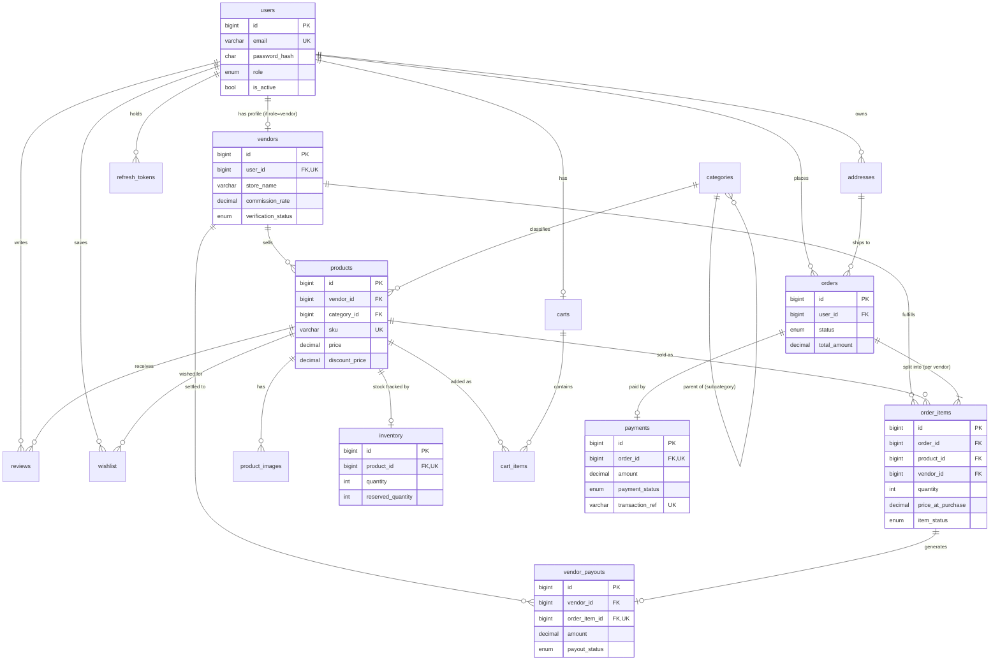

# ER Diagram (Mermaid)

Paste into any Mermaid renderer (GitHub, mermaid.live) to render. Cardinalities and
key relationships are annotated. `||` = exactly one, `o{` = zero-or-many, `|{` = one-or-many.

## Key modeling decisions
- **`vendors` is a 1:1 extension of `users`** (not a subtype table dump) — role lives on `users`,
  vendor-only attributes live on `vendors`. Enforced by `uq_vendors_user`.
- **`order_items.vendor_id` is denormalized** from `products.vendor_id` so a vendor's sub-order is a
  cheap indexed lookup (`idx_oi_vendor_status`) and payouts survive later product re-assignment.
- **`inventory` split from `products`** keeps the hot, frequently-locked stock row narrow, reducing
  lock contention and buffer-pool churn during checkout.
- **`order_items.price_at_purchase`** freezes price — the only intentional denormalization, because an
  order is a legal record that must not change when the catalog price later changes.
